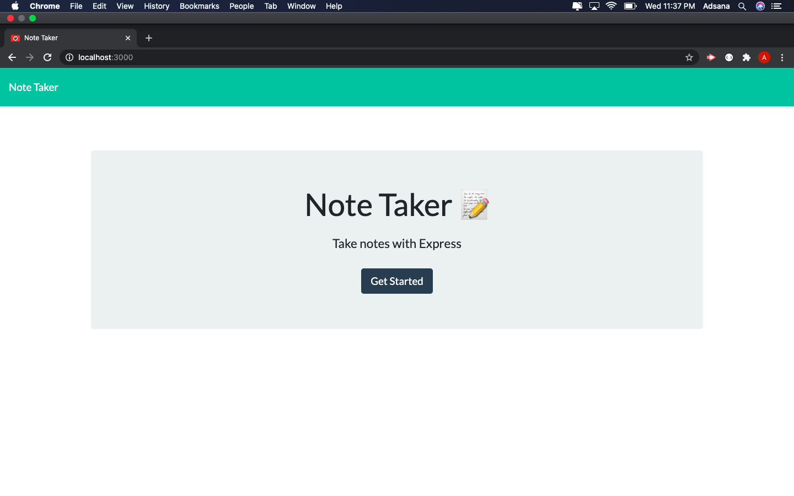

# note-taker app
Note taking application designed to write, save, and delete notes, written to and retrieved from a backend JSON file

Prior to running the app, change directory to where the repo was downloaded in your terminal.
run npm install and then npm install express

To start the app run node app.js

Then once the serving is running, head to your browser and go to the address localhost:3000
and you will land on the below page. Click start when you're ready.

Here you'd fill in a title, notes, and are to save it and access it later to the left.  When you no longer need it click the trash can to delete.

Unfortunately I was unsuccessful in deploying to heroku for unknown reasons, but was able to run it locally on my computer.
